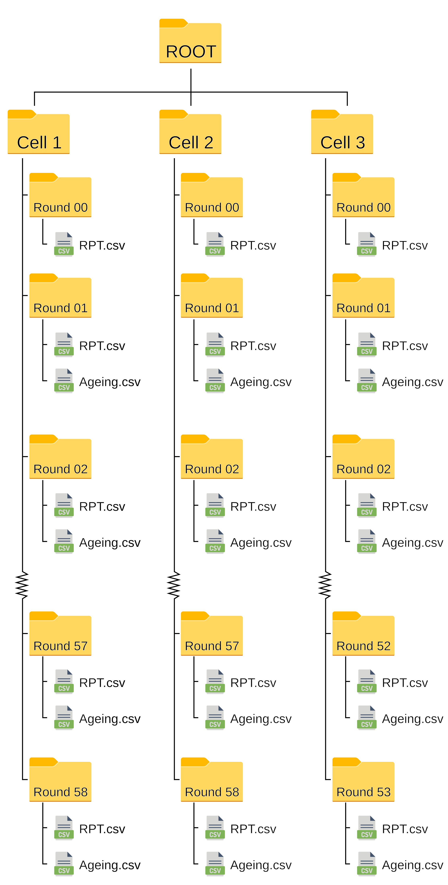

# Scripts extracting and modelling battery partial charges for reliable state-of-health estimation

This repository contains the scripts needed for extracting features from
partial charges by using partial voltage intervals, and use these
features for modelling battery state-of-health (SOH). The entire
analysis pipeline was written and performed in `R`, using `tidyverse`
for data preparation, pre-processing, and visualisation, `stats` and
`MASS` for modelling SOH by multiple linear regression (MLR), `kernlab`
for modelling SOH by support vector regression (SVR), `ranger` for
modelling SOH by random forest (RF), and `keras` modelling SOH by feed
forward neural networks (NN).

This code was used to generate the results for the paper “Using battery
partial charging for reliable state-of-health estimation” (submitted).

## Data

The original analysis was performed using two data-sets, the designed to
emulate the operation of a forklift, while the second was designed using
the WLTC driving profile. Only the forklift data-set is publicly
available: [Mendeley Data](https://doi.org/10.17632/yz4pttm73n.2).

A more thorough introduction to the forklift data-set can be found at:
[“Dataset of lithium-ion battery degradation based on a forklift mission
profile for state-of-health estimation and lifetime prediction”, S. B.
Vilsen and D.-I. Stroe, Data in Brief
(2024)](https://www.sciencedirect.com/science/article/pii/S2352340923009228).

New data can also be added to the analysis, if it follows the same
format as the forklift data-set. That is, needs to have the following
folder, file, and naming structure:

The name of the `ROOT` directory, shown in the figure, is used in
subsequent analyses as the name of the profile, i.e., `ROOT` folder
names should not be duplicated. Furthermore, both RPT and ageing files
are expected to be in a `.csv` format, and contain the following
columns:

| Cell | Round | Part |   Time |  Current | Voltage |  Energy | Temperature |
|-----:|------:|-----:|-------:|---------:|--------:|--------:|------------:|
|    1 |     1 |    1 |  0.000 |   0.0000 |  3.3383 |  0.0000 |      44.862 |
|    1 |     1 |    1 |  3.133 |  -2.9977 |  3.3378 | -0.0027 |      44.892 |
|    1 |     1 |    1 |  4.126 | -20.9992 |  3.3341 | -0.0200 |      44.892 |
|    1 |     1 |    1 |  5.146 | -44.9995 |  3.3289 | -0.0605 |      44.847 |
|    1 |     1 |    1 |  6.120 | -32.9985 |  3.3305 | -0.0885 |      44.847 |
|    1 |     1 |    1 |  7.120 | -34.9981 |  3.3297 | -0.1208 |      44.847 |
|    1 |     1 |    1 |  8.119 | -41.9984 |  3.3278 | -0.1588 |      44.853 |
|    1 |     1 |    1 |  9.107 | -34.9981 |  3.3287 | -0.1921 |      44.853 |
|    1 |     1 |    1 | 40.121 | -44.9978 |  3.3165 | -1.4808 |      44.871 |
|    1 |     1 |    1 | 41.124 | -42.9982 |  3.3167 | -1.5187 |      44.802 |

If the profile used to generate the data was not separated into parts,
then the column `Part` should just contain the number `1` for all
entries. Furthermore, the column `Energy` is not utilised in the
analyses.

## Scripts

The repository contains five scripts (four working scripts and a master
script):

-   `00-master.R`: The master script loads packages, sets default
    plotting behaviour, paths for data, files, and figures, and
    (de-)activates scripts for (re-)running analyses. The behaviour of
    the remaining scripts are controlled by `TRUE/FALSE` flags, e.g.,
    setting `make_figures = TRUE` will be (re-)make every figure in the
    `04-visualisemodels.R`-script.

-   `01-extractcapacity.R`: A script for extracting capacity
    measurements from RPT files; the script depends on the functions
    found in `Functions/capacity_functions.R`.

-   `02-extractfeatures.R`: A script for identifying partial charges and
    extracting features from each of each partial charge, given a
    pre-specified voltage interval; the script depends on the functions
    found in `Functions/feature_functions.R`.

-   `03-trainmodels.R`: A script used to define relevant features,
    random split the data into training and validation-sets, normalise
    the features (based solely on the training-set), and train models
    using the training-set.

-   `04-visualisemodels.R`: A script used to visualise the trained
    models, and determine the feature importance for each model.

## License

This project is licensed under the MIT License.
